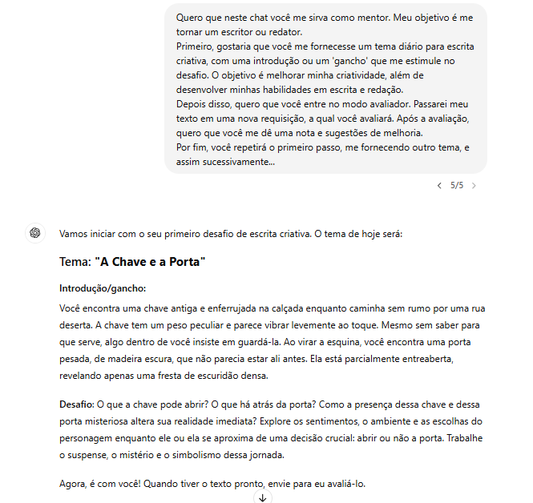

# O que é o ChatGPT?  

De maneira simples, ele é um chatbot - um programa de computador super inteligente projetado para imitar conversas com usuários humanos, através da internet.  

O que distingue o ChatGPT dos chatbots tradicionais é seu modelo de linguagem que utiliza da [Inteligência Artificial Generativa](https://www.surfedigital.io/blog/ia-generativa) (Generative AI). Este modelo **permite que o ChatGPT entenda e responda de maneira mais humana, utilizando linguagem natural** e contextualizada, oferecendo uma experiência às pessoas muito mais rica, próxima e interativa.  

Além disso, o ChatGPT é capaz de aprender com as interações, adaptando-se e aprimorando suas respostas ao longo do tempo.  

**FONTE:** 
[ChatGPT: o que é, como funciona e como utilizar](https://www.surfedigital.io/blog/chatgpt)  

# **Como começar a utilizá-lo?**  

Primeiramente, acesse e cadastre-se pelo seguinte link [ChatGPT](https://chatgpt.com/)  

O cadastro é rápido. Você não precisará preencher formulários. Basta fornecer um endereço de e-mail e uma senha. Se preferir, utilize um e-mail já existente, seja do Google, Microsoft ou Apple.  

  

Pronto! Uma vez que tenha feito o cadastro, seu ChatGPT estará pronto para as suas requisições.  
 
# **Como abrir um Novo Chat?**  

O print abaixo é a tela principal da aplicação. É a tela que você verá após realizar o cadastro. Note que ela já traz alguns exemplos de uso, como: 'Receita com o que tem na cozinha', 'Confortar um amigo', etc. Note também que no menu lateral há a opção 'Explorar GPTs'. Ao clicar nela, você verá que já existem inúmeras aplicações disponíveis através da ferramenta.  

  

  

No ChatGPT, você pode criar vários chats de acordo com os assuntos que deseja abordar. Há duas formas de criar um novo chat na aplicação, e ambas são bem intuitivas. A primeira é através do ícone e a segunda através da opção “ChatGPT”.  

Uma vez aberto o novo chat, faça a requisição que deseja.  

  

  

Quando falamos em aplicações de inteligência artificial, qualquer entrada ou solicitação é chamada de prompt. Em resumo, um prompt é tudo aquilo que você digita ou diz para iniciar uma interação com um sistema. Não há nenhum segredo aqui, basta entregar uma entrada ao ChatGPT. Digite uma mensagem ou envie um documento - essa funcionalidade é nova. Veja, aqui pedi ao chat para me dar dicas sobre como utiliza-lo:  

  

  

Fácil, não? Note que assim que ele me respondeu à solicitação, ele também criou ali uma aba através do chat recém-aberto. Você pode renomear a aba clicando em "Renomear" através dos três pontos. Assim:  

Da mesma forma, através do botão dos três pontos, você pode “Arquivar”, “Compartilhar” ou “Excluir”  

  

  

# **Para que serve, e por que eu deveria utilizar o ChatGPT?**  

Esta aplicação, é valiosa para quem precisa de um auxilio para se organizar, ou organizar suas ideias, assim como para qualquer pessoa que deseja ajuda em seus trabalhos acadêmicos, criativos, projetos pessoais, e afins. Vamos ver alguns exemplos que podem ser úteis no nosso dia a dia.  

# **Corretor ortográfico:**  

  

# **⚫ Bloco de notas:**  

  

  

# **⚫ Professor do que você desejar:**  

  

  

# **⚫ Sessões de terapia:**  

  

# **⚫ Ampliar suas habilidades de escrita:**  

  

Acredito que os exemplos de prompts que eu dei neste tutorial são até mesmo bem elaborados para quem é iniciante, mas fiz isso com o intuito de mostrar a você o quanto o ChatGPT pode ser útil no dia a dia. Muita gente tem medo de inteligências artificiais - e esse medo é, até certo ponto, muito justificável - mas acho que consegui comprovar aqui, por meio desses exemplos, que podemos muito bem utilizar essas novas tecnologias em nosso benefício.