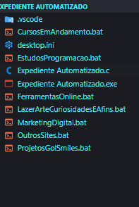
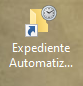
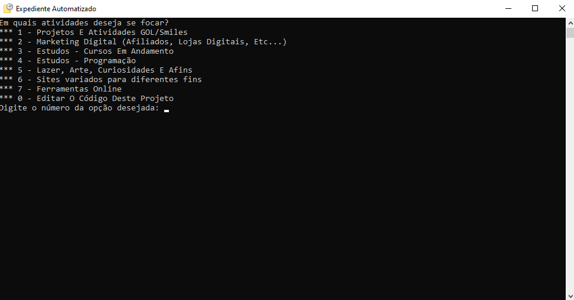
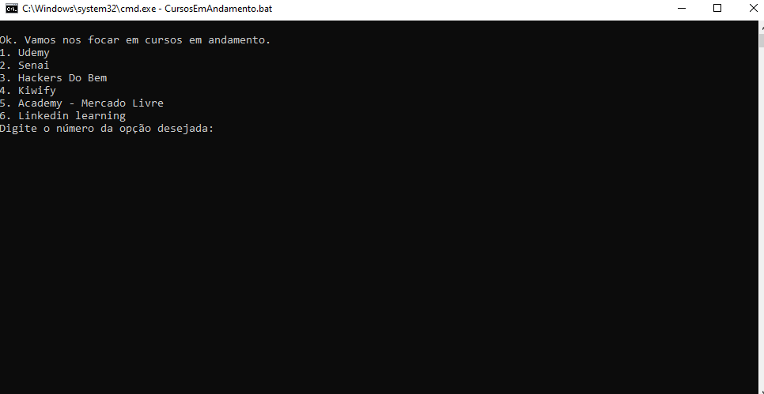

Concebi este projeto com o objetivo de armazenar, em um único lugar, os links dos aplicativos e portais que utilizo ao longo da semana, durante o tempo em que estou em frente ao computador.

Com o tempo, encontrei maneiras mais eficientes e práticas de me organizar, mas ainda gosto de utilizar esse programinha para salvar links de mangás e blogs que eu gosto de ler e acompanhar, além de documentos de bibliotecas úteis para meus projetos. 

De todo modo, este projeto foi extremamente útil para que eu  aprendesse mais sobre programação em Batch Script e C.

A estrutura do projeto é simples: O arquivo principal, **Expediente Automatizado.c**, corresponde ao menu principal da aplicação. Cada item deste menu direciona para um script `.bat` específico.

## ⚫**Expediente Automatizado.c**

```c
#include <stdio.h>
#include <conio.h>
#include <locale.h>
#include <stdlib.h>
#include <windows.h>

//#region função para rodar os script .bat
void runScript(const char *scriptName){
    char command[100];
    sprintf(command, "start %s", scriptName);
    system(command);
}
//#endregion

int main() {
    while (1) {
        system("chcp 65001 > nul");
        setlocale(LC_ALL,"pt_BR.UTF-8");
        system("cls");
        printf("Em quais atividades deseja se focar?\n");
        printf("*** 1 - Projetos E Atividades GOL/Smiles\n");
        printf("*** 2 - Marketing Digital (Afiliados, Lojas Digitais, Etc...)\n");
        printf("*** 3 - Estudos - Cursos Em Andamento\n");
        printf("*** 4 - Estudos - Programação\n");
        printf("*** 5 - Lazer, Arte, Curiosidades E Afins\n");
        printf("*** 6 - Sites variados para diferentes fins\n");
        printf("*** 7 - Ferramentas Online\n");
        printf("*** 0 - Editar O Código Deste Projeto\n");
        
        char choice;

        printf("Digite o número da opção desejada: ");
        choice = _getch();
        printf("%c\n", choice);

        switch (choice){
        case '1':
            runScript("ProjetosGolSmiles.bat");
            break;
        case '2':
            runScript("MarketingDigital.bat");
            break;
        case '3':
            runScript("CursosEmAndamento.bat");
            break;
        case '4':
            runScript("EstudosProgramacao.bat");
            break;
        case '5':
            runScript("LazerArteCuriosidadesEAfins.bat");
            break;
        case '6':
            runScript("OutrosSites.bat");
            break;
        case '7':
            runScript("FerramentasOnline.bat");
            break;
        case '0':
            system("code .");
            break;
        default:
            break;
        }
        exit(0);
    }
    return 0;
}
```

A função `runScript` é usada para executar nossos scripts `.bat`. Note que:

- Ela não retorna nenhum valor por ser uma função do tipo `void`
- `const char *scriptName`: Um ponteiro constante para um caractere, representando o nome do script a ser executado. O `const` indica que o conteúdo apontado pelo ponteiro não deve ser modificado pela função.
- Um array de caracteres (`char`) de tamanho 100, que será usado para armazenar o comando que será executado.
- `sprintf`: Função da biblioteca padrão do C que escreve uma string formatada em um buffer.
- `command`: Buffer onde a string formatada será armazenada.
- `"start %s"`: String de formato. `start` é o comando (no contexto de sistemas Windows, `start` é usado para iniciar um programa ou script). `%s` é um especificador de formato que será substituído pelo valor de `scriptName`.
- `scriptName`: Nome do script que será inserido no lugar de `%s`.
- `system`: Função da biblioteca padrão do C que passa o comando para o interpretador de comandos do sistema operacional. Executa o comando armazenado na variável `command`.

O loop infinito permite que o menu seja mostrado repetidamente. No entanto, o programa termina com `exit(0)` após executar uma ação.

- O `system("chcp 65001 > nul");` - Configura o console para usar UTF-8, garantindo que caracteres especiais sejam exibidos corretamente.
- `setlocale(LC_ALL, "pt_BR.UTF-8");` - Define a localidade para Português do Brasil com UTF-8, afetando a formatação de saída, como datas e números.
- `system("cls");` - Limpa a tela do console, útil para manter a interface do usuário limpa e legível.
- `_getch` lê um caractere do console sem exibi-lo, permitindo que a escolha do usuário seja capturada discretamente.
- Estrutura `switch` para escolha

## ⚫**Arquivos `.bat`**

Nesse nosso projeto, os arquivos `.bat` receberão essencialmente a mesma estrutura. A única coisa que diferenciará um arquivo do outro é o conteúdo que armazenam, as URLs que eles contém.

## ⚫**Estrutura básica código dos arquivos `.bat`**

```bash
@echo off
echo.
chcp 65001 > nul

set "firefoxPath=C:\Program Files\Mozilla Firefox\firefox.exe"
set "edgePath=C:\Program Files (x86)\Microsoft\Edge\Application\msedge.exe"
set "chromePath=C:\Program Files (x86)\Google\Chrome\Application\chrome.exe"

echo Ok. Confira as opções abaixo:
echo 1.Coleção de links 1
echo 2.Coleção de links 2
::inclua quantas opções desejar, e dentro da estrutura if, inclua quantos links desejar

set /p escolha=Digite o número da opção desejada:

if "%escolha%"=="1" (
    start "link 1" "%edgePath%" "https://www.link1.com"
    start "link 2" "%edgePath%" "https://www.link2.com"
)

if "%escolha%"=="2" (
    start "link 1" "%edgePath%" "https://www.link1.com"
    start "link 2" "%edgePath%" "https://www.link2.com"
)
exit
```

Para finalizarmos o nosso projeto agora só resta criarmos um `.exe` do nosso arquivo `.c`
Você pode criar um atalho desse `.exe` e deixá-lo na área de trabalho

**O diretório do meu projeto no fim ficou assim:**



**Aqui está o atalho do executável que eu criei na área de trabalho:**



**Este é o programa em execução:**



