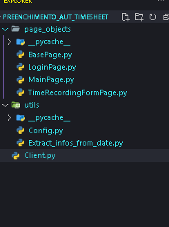

**Este é um simples projeto de automação em Selenium Python concebido pela necessidade de deixar de me esquecer de fazer o meu apontamento de horas no fim do dia.**

## Requisitos para o projeto:

- Tenha instalado o Python e a biblioteca Selenium.

**O projeto terá a seguinte estrutura de arquivos e pastas:**



- Nessa estrutura, o diretório `utils` irá conter o arquivo `Config.py` e `Extract_infos_from_date`. Criar uma pasta chamada "utils" é uma prática comum em muitos projetos de programação. Esta pasta é frequentemente usada para armazenar módulos, classes ou funções que fornecem funcionalidades auxiliares, utilitárias ou complementares ao projeto principal.
    - A `Config.py` contém informações referentes a URL da aplicação, meu login e senha.
    - O `Extract_infos_from_date.py` possui 2 funções para extrair informações relativas a data (Ano, Mês e dia)
- `Page Objects` é um padrão de projeto utilizado em automação de testes de interface de usuário (UI). Ele ajuda a organizar e estruturar o código de automação, tornando-o mais fácil de entender, manter e escalar.
Basicamente, `Page Objects` representam as páginas ou componentes de uma aplicação web como objetos em seu código de automação. Cada página ou componente é representado por uma classe, e os elementos dessa página (como botões, campos de texto, etc.) são encapsulados como métodos e atributos dentro dessa classe. Note no print, que foram criadas uma classe para cada página da aplicação Web que vamos automatizar. Entre essas classes, a mais importante é a `BasePage.py`, pois:
    - Ela encapsula métodos que são comumente usados para interagir com elementos da página, como clicar em um elemento ou enviar texto para um campo de entrada. O conceito de abstração em programação orientada a objetos (POO) envolve a criação de interfaces ou classes abstratas que representam características comuns entre diferentes objetos. Na situação da BasePage, estamos abstraindo a lógica de interação com elementos da página.
    - A utilização de métodos como WebDriverWait e expected_conditions garante que o Selenium aguarde até que um determinado elemento esteja disponível na página antes de interagir com ele. Isso ajuda a evitar falhas de teste devido a elementos não encontrados ou indisponíveis.
    - Ao inicializar o driver e criar uma instância de ActionChains na BasePage, você centraliza essa lógica em um único lugar. Isso torna mais fácil configurar e modificar o comportamento do driver em toda a sua aplicação. Em POO chamamos isso de encapsulamento
    - Outras classes de página em seu projeto podem herdar da BasePage, o que significa que elas terão acesso aos métodos e funcionalidades definidos na BasePage. Isso promove a consistência e a padronização em todo o seu projeto. Em POO chamamos isso de Herança

**Confira a seguir o conteúdo de cada um dos arquivos, e a ordem de criação do projeto:**

## ⚫ Criação do diretório page_objects e `BasePage.py`

**`BasePage.py`**

```python
from selenium.webdriver.support.ui import WebDriverWait
from selenium.webdriver.support import expected_conditions as EC
from selenium.webdriver import ActionChains

class BasePage:
    def __init__(self, driver):
        self.driver = driver
        self.ac = ActionChains(self.driver)

#region Métodos tratados com expected_conditions para click, e send_keys
    def find_and_send_keys(self, locator, *keys):
        element = WebDriverWait(self.driver, 10).until(EC.visibility_of_element_located(locator))
        self.ac.move_to_element(element).click().send_keys(*keys).perform()

    def find_and_click(self, locator):
        element = WebDriverWait(self.driver, 10).until(EC.element_to_be_clickable(locator))
        self.ac.move_to_element(element).click().perform()
#endregion

```

## ⚫ Criação do diretório utils, do `Config.py` e `LoginPage.py`

**`Config.py`**

```python
URL = "URL_da_aplicação_WEB"
LOGIN_USER = "Login"
LOGIN_PASS = "Senha"

```

**`LoginPage.py`**

```python
from page_objects.BasePage import BasePage
from utils.Config import LOGIN_PASS,LOGIN_USER
from selenium.common.exceptions import TimeoutException
from selenium.webdriver.support import expected_conditions as EC
from selenium.webdriver.common.by import By

class LoginPage(BasePage):
    def __init__(self, driver):
        super().__init__(driver)

    def logar_no_sharepoint(self):
        # Elementos
        username_input = (By.NAME,'loginfmt')
        button = (By.ID,'idSIButton9')
        pass_input = (By.NAME,'passwd')
        # Ações
        self.find_and_send_keys(username_input, LOGIN_USER)
        self.find_and_click(button)
        self.find_and_send_keys(pass_input, LOGIN_PASS)
        self.find_and_click(button)

        try:
            while EC.presence_of_element_located(button):
                self.find_and_click(button)
        except TimeoutException:
            print("OK")

```

## ⚫ Criação do arquivo `Extract_infos_from_date.py` e das classes **page_objects** restantes

**`Extract_infos_from_date.py`**

```python
import time
def extrair_mes_ano():
    # Lista com os nomes dos meses
    meses_do_ano = ["Janeiro", "Fevereiro", "Março", "Abril",
        "Maio", "Junho", "Julho", "Agosto",
        "Setembro", "Outubro", "Novembro", "Dezembro"]

    # Obter o tempo atual em segundos
    tempo_atual = time.time()

    # Converter o tempo atual em uma tupla com as informações locais
    info_tempo_local = time.localtime(tempo_atual)

    #Extrair o mês da tupla
    mes_vigente = info_tempo_local.tm_mon
    #Extrair o ano da tupla
    ano_vigente = info_tempo_local.tm_year
    #Obter o nome do mês correspondente
    nome_mes_vigente = meses_do_ano[mes_vigente -1]

    nome_mes_e_ano_vigente = f'{nome_mes_vigente.lower()} {ano_vigente}'
    return nome_mes_e_ano_vigente, nome_mes_vigente, ano_vigente

def extrair_data_completa():
    _,nome_mes_vigente, ano_vigente = extrair_mes_ano()
    #mes_e_ano_vigente, nome_mes_vigente, ano_vigente = extrair_mes_ano()
    #Extrair o dia da tupla
    dia_vigente = time.localtime().tm_mday

    return f'{nome_mes_vigente.capitalize()} {dia_vigente}, {ano_vigente}'

```

**`MainPage.py`**

```python
from page_objects.BasePage import BasePage
from selenium.webdriver.support import expected_conditions as EC
from selenium.webdriver.common.by import By
from utils.Extract_infos_from_date import extrair_mes_ano

class MainPage(BasePage):
    def __init__(self, driver):
        super().__init__(driver)

    def selecionar_o_mes_para_realizar_lancamento(self):
        nome_mes_e_ano_vigente = extrair_mes_ano()[0]

        # Elementos
        month_selection_area = (By.XPATH, '//*[@role="gridcell"]/..//*[@data-automationid="DetailsRowCell"]/..//*[contains(text(),"'+nome_mes_e_ano_vigente+'")]')
        launch_button = (By.XPATH, "//*[contains(text(),'Lançamentos')]")
        #Ações
        self.find_and_click(month_selection_area)
        self.find_and_click(launch_button)

```

**`TimeRecordingFormPage.py`**

```python
from page_objects.BasePage import BasePage
from selenium.webdriver.support import expected_conditions as EC
from selenium.webdriver.common.by import By
from selenium.webdriver.common.keys import Keys
from utils.Extract_infos_from_date import extrair_data_completa

class TimeRecordingFormPage(BasePage):
    def __init__(self, driver):
        super().__init__(driver)

    def preencher_o_form_e_salvar(self):
        data_completa = extrair_data_completa()
        # Elementos mapeados e ações para Novos Lançamentos - Formulário de preenchimento
        date_select_box = (By.XPATH, '//*[@aria-label="Selecione uma data"]')
        day_item = (By.XPATH, '//*[@aria-label="'+data_completa+'"]')
        start_time = (By.XPATH, '//*[@name="horaInicial"]')
        end_time = (By.XPATH, '//*[@name="horaFinal"]')
        lunchtime = (By.XPATH, '//*[@name="horaAlmoco"]')
        project_select_box = (By.XPATH,'(//*[@role="listbox"])[2]')
        task_select_box = (By.XPATH,'(//*[@role="listbox"])[3]')
        save_button = (By.XPATH,'//*[button]/..//*[contains(text(),"Salvar")]')

        self.find_and_click(date_select_box)
        self.find_and_click(day_item)
        self.find_and_send_keys(start_time, "AM", Keys.ARROW_LEFT, Keys.ARROW_LEFT, "0900")
        self.find_and_send_keys(end_time, "PM", Keys.ARROW_LEFT, Keys.ARROW_LEFT, "0600")
        self.find_and_send_keys(lunchtime, "AM", Keys.ARROW_LEFT, Keys.ARROW_LEFT, "0100")
        self.find_and_send_keys(project_select_box,Keys.TAB)
        self.find_and_send_keys(task_select_box,Keys.TAB)
        self.find_and_click(save_button)
        #endregion

```

## ⚫ Criação do arquivo `Client.py`

**`Client.py`**

```python
from utils.Config import URL
from page_objects.LoginPage import *
from page_objects.MainPage import *
from page_objects.TimeRecordingFormPage import *
from selenium import webdriver

driver = webdriver.Firefox()
driver.get(URL)

login_page = LoginPage(driver)
main_page = MainPage(driver)
time_recording_form_page = TimeRecordingFormPage(driver)

login_page.logar_no_sharepoint()
main_page.selecionar_o_mes_para_realizar_lancamento()
time_recording_form_page.preencher_o_form_e_salvar()

```

---

**Aqui terminamos tudo o que era necessário ao projeto em termos de automação, mas ainda há algumas coisas interessantes que podemos fazer, como:**

## ⚫ Criar um executável da automação que acabamos de criar

Para isso, existem muitas opções como o `cxFreeze`, ou o `pyinstaller`, mas aqui, eu decidi utilizar a biblioteca `Nuitka`.

Para instalar esta biblioteca, dê o comando:

```bash
pip install nuitka

```

Confira no link a seguir a documentação oficial da biblioteca: [Nuitka - User Documentation](https://nuitka.net/user-documentation/)

Queremos derivar um arquivo `.exe` do nosso `Client.py`. Queremos também que esse `.exe` tenha todas as dependências necessárias, tornando-o autocontido e portátil. Para isso, servirá a opção `--standlone`. Por fim, vamos definir um destino para o nosso executável e um ícone. Podemos criar um diretório em nosso projeto chamado assets e incluir nele um ícone qualquer. Nossa linha de comando então ficará assim:

```bash
python -m nuitka --standalone Client.py --windows-icon-from-ico=assets/robotic.ico --output-dir=../../"Timesheet Automatizado"

```

O processo demora um pouco, mas ao final dele teremos:

- O diretório com o nome que definimos na linha de comando ("Timesheet Automatizado") e dentro dele, mais dois diretórios: `Client.build` e `Client.dist`


Nos projetos Python, os diretórios `build` e `dist` são comumente usados durante o processo de construção e distribuição de pacotes ou aplicativos.
O `build` é geralmente usado como o local onde são armazenados os arquivos intermediários gerados durante o processo de construção do projeto.
O `dist`, por sua vez, é usado para armazenar os arquivos de distribuição final gerados após o processo de construção.

Encontramos o nosso arquivo executável no dist:


Gosto de criar um atalho para a área de trabalho, e uma vez lá, definir uma tecla de atalho para acionar o programa de forma facilitada.


Isso tudo já deve resolver o meu problema, mas vamos automatizar ainda mais - por que eu adoro isso. Posso criar aqui um script em Powershell, e chama-lo em um `.bat` .por exemplo. inclui-lo na pasta startup `C:\\Users\\Particular\\AppData\\Roaming\\Microsoft\\Windows\\Start Menu\\Programs\\Startup`

## ⚫ Criando um script em Powershell para que rode a automação apenas quando for 21h e se eu assim quiser

Não há muito segredo aqui, e o Powershell não é tão difícil de entender também. Precisaremos verificar se o horário atual corresponde a 21h, e disparar um popup caso seja. Precisaremos também validar a resposta do usuário, e de acordo com ela rodar ou não a automação.

**`scheduled_to_9pm.ps1`**

```powershell
# Exibe uma mensagem de alerta informando que o script está rodando
Add-Type -AssemblyName 'System.Windows.Forms'
[System.Windows.Forms.MessageBox]::Show("Script em funcionamento!", "Alerta", "OK", "Information")

# Aguarda até que seja 21h
while ((Get-Date).Hour -ne 11) {
    Start-Sleep -Hours 1
}

# Agora é 21h, exibe o popup perguntando se deseja rodar a automação do timesheet
$result = [System.Windows.Forms.MessageBox]::Show("Deseja rodar o Timesheet Automatizado hoje?", "Alerta", "YesNo", "Question")

# Verifica a resposta do usuário
if ($result -eq "Yes") {
    # Caminho do executável
    $exePath = "$env:UserProfile\\Desktop\\Timesheet Automatizado.lnk"
    # Executa o executável da automação do timesheet
    Start-Process -FilePath $exePath
}

# Encerra o script
Exit

```

Podemos testar se deu certo, modificando manualmente o horário do nosso PC.
Por fim, vamos criar mais um arquivo. Agora um `.bat`.

```
@echo off

powershell.exe -WindowStyle Hidden -ExecutionPolicy Bypass -File "./scheduled_to_9pm.ps1" > NUL 2>&1

```

Inclua esse .bat no seu diretório Startup e teste o funcionamento de tudo.
