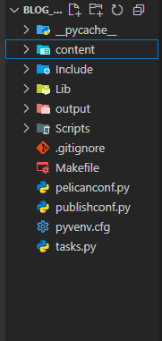

Este blog, no qual você navega, é hoje meu maior orgulho como desenvolvedor. Ele foi criado — entre outras razões — para compartilhar, com vocês e com a posteridade, o conhecimento que acumulei em programação e tecnologia. Por isso, decidi escrever este post, mostrando como o construí. Espero, sinceramente, que este conteúdo lhes seja útil.

# Primeiros passos

***Todo esse blog foi construído graças ao Pelican que é um gerador de sites estáticos escrito em Python. Você pode conferir a documentação oficial através do link: [https://getpelican.com/](https://getpelican.com/)***

No VsCode, após ter criado o diretório do seu projeto,

- Crie um [ambiente virtual](https://docs.python.org/pt-br/3.13/library/venv.html) e instale o Pelican:
    
    ```bash
    python -m venv .
    source meu-blog/bin/activate  # No Windows: .\Scripts\activate
    pip install pelican markdown
    
    ```
    
- Feita a instalação, crie um  novo projeto Pelican com o comando:
    
    ```bash
    pelican-quickstart
    
    ```
    

**Responda, por fim, as perguntas conforme forem aparecendo com Y/N.**

Feito isso a estrutura do nosso projeto será formada:

 



Importante notar que, o arquivo [`pelicanconf.py`](http://pelicanconf.py) é onde teremos as configurações referentes ao desenvolvimento, enquanto no `publishconf.py` teremos as nossas configurações de produção. Sendo assim, a variável: `SITEURL`,  estará vazia no `pelicanconf.py` e deve ter o seu domínio pessoal em `publishconf.py`

Configurado o arquivo `pelicanconf.py`, vamos ao nosso `hello world`

- Acesse a pasta `content` e crie um arquivo `.md` para que seja sua página inicial. Ex: `home.md`
    - Como a intenção é a criação de um blog, crie uma pasta chamada `pages` e outra chamada `posts`
    - Inclua a `home.md` na `pages`
- No conteúdo de seu arquivo.md, você terá que incluir, antes de qualquer texto, imagem, ou mídia, uma seção de metadados com delimitadores `---`
    
    ```markdown
    ---
    Title: Página Inicial
    Save_as: index.html
    ---
    
    [Seu conteúdo aqui]
    ```
    

- Para gerar os arquivos estáticos do seu site, execute o seguinte comando no terminal, na raiz do seu projeto:
    
    ```bash
    pelican content
    
    ```
    

Este comando processará os arquivos no diretório `content/` e gerará o site estático no diretório `output/`.


- Por fim, e aqui chegamos ao final da etapa 1 da criação do nosso blog, inicie o servidor de desenvolvimento com o seguinte comando:
    
    ```bash
    pelican -r -l
    
    ```
    

Este comando gera o conteúdo e inicia um servidor local que permite visualizar o site através do endereço: `http://localhost:8000`

## Vamos criar agora o nosso próprio tema

Quando executamos o comando: `pelican content` ou o  `pelican content -s pelicanconf.py`, o **Pelican** gera na pasta **output** as pastas e arquivos referentes aos temas de sua página, porém, será um tema padrão, que no caso não nos interessa. 

Para trabalharmos com o nosso próprio tema, primeiro, temos que definir a seguinte estrutura de arquivos e pastas: 


Feita essa estrutura, temos que passar o *path* da pasta do nosso tema na variável **THEME** do arquivo **pelicanconf.py**:

```python
THEME = "./tema/"
```

- Acesse agora o arquivo **base.html**. O arquivo que será renderizado no navegador será o index.html. O base.html, nos servirá aqui para fins de encapsulamento. Ele terá o seguinte código:

```html
<!DOCTYPE html>
<html lang="en">
<head>
    <meta charset="UTF-8">
    <meta name="viewport" content="width=device-width, initial-scale=1.0">
    <title>Document</title>
</head>
<body>
    
    
</body>
</html>
```

- Agora no **index.html**, podemos herdar o que há no arquivo base.html, através da linha ``
    - Podemos chamar as variáveis contidas no arquivo **pelicanconf.py**, utilizando `{{ }}`  - Leia sobre [Jinja2](https://jinja.palletsprojects.com/en/stable/) para entender mais do porque disso.

```html


<h2>{{ SITENAME }}</h2>
<p>Bem vindo ao meu blog</p>

```


### Estilização do Blog

A seguir exibo o conteúdo dos arquivos utilizados na construção do meu tema.

### Base.html

**`tema\templates\base.html`**

```html
<!DOCTYPE html>
<html lang="pt-br">
<head>
    <meta charset="UTF-8">
    <meta name="viewport" content="width=device-width, initial-scale=1.0">
    <!-- #region Font Awesome e Bootstrap Libs -->
    <link rel="stylesheet" href="https://cdn.jsdelivr.net/npm/bootstrap@5.3.3/dist/css/bootstrap.min.css" 
    integrity="sha384-QWTKZyjpPEjISv5WaRU9OFeRpok6YctnYmDr5pNlyT2bRjXh0JMhjY6hW+ALEwIH" 
    crossorigin="anonymous">
    <link rel="stylesheet" href="https://cdnjs.cloudflare.com/ajax/libs/font-awesome/6.7.2/css/all.min.css" 
    integrity="sha512-Evv84Mr4kqVGRNSgIGL/F/aIDqQb7xQ2vcrdIwxfjThSH8CSR7PBEakCr51Ck+w+/U6swU2Im1vVX0SVk9ABhg=="
    crossorigin="anonymous" 
    referrerpolicy="no-referrer" />
    <link rel="stylesheet" href="https://cdnjs.cloudflare.com/ajax/libs/font-awesome/6.7.2/css/brands.min.css"
    integrity="sha512-58P9Hy7II0YeXLv+iFiLCv1rtLW47xmiRpC1oFafeKNShp8V5bKV/ciVtYqbk2YfxXQMt58DjNfkXFOn62xE+g==" 
    crossorigin="anonymous" 
    referrerpolicy="no-referrer" />
    <!--#endregion-->
    <link rel="stylesheet" href="{{ SITEURL }}/theme/css/style.css">
    <title>{{ SITENAME }}</title>

</head>
<body class="d-flex flex-column min-vh-100">
    <!-- #region Header -->
     
     <header class="bg-dark text-white text-center py-4">
        <div class="container">
            <div class="logo">
                
                <span class="devonfire-text">
                    DevOnFire
                </span>
            </div>
            <h1>Artigos, códigos e devaneios</h1>
            <p class="lead">Espero que curtam. Tudo aqui deu trabalho pra fazer 🤙</p>
        </div>
     </header>
     
    <!-- #endregion -->
    <!-- #region Espaço reservado para o botão e a funcionalidade de arquivo do Blog -->
    <!-- #endregion-->
    <!-- #region conteúdo Principal -->
    <main class="flex-glow-1">
        
        
    </main>
    <!-- #endregion -->
    <!-- #region footer -->
    <footer class="footer mt-auto py-4" style="background-color: #000; color: #fff;">
        <div class="container">
            <div class="row align-items-center">
                <div class="col-md-4 text-center text-md-start">
                    <a href="{{ SITEURL }}/">
                    
                    </a>
                </div>
                <div class="col-md-4 text-center">
                    <p class="mb-0" 
                    style="color: #EE471D;">
                    &copy; {{ SITEYEAR }} 
                    DevOnFire. Todos os direitos reservados a 
                    <a href="https://github.com/robsings" 
                        target="_blank"
                        style="color:#fcfcfc;text-decoration:none;font-weight:900">
                        robsings
                    </a>.
                    </p>
                </div>
                <div class="col-md-4 text-center text-md-end">
                    <a href="https://github.com/robsings" 
                    target="_blank" 
                    class="text-white me-3" 
                    title="Github - robsings">
                    <i class="fa-brands fa-square-github"></i>
                    </a>
                    <!-- TODO: Inclua novas redes sociais aqui -->
                </div>
            </div>
        </div>
    </footer>
    <!-- #endregion -->

    <!-- #region Bootstrap Lib -->
    <script src="https://cdn.jsdelivr.net/npm/bootstrap@5.3.3/dist/js/bootstrap.min.js">
    </script>
    <!-- #endregion -->
    
    <script>
        (function() {
            let siteName = '{{ SITENAME }}';  // sem escapejs
            let message = "🔥 " + siteName;
            let speed = 290;

            function scrollTitle() {
                document.title = message;
                message = message.substring(1) + message.charAt(0);
                setTimeout(scrollTitle, speed);
            }

            scrollTitle();
        })();
</script>

    </script>
</body>
</html>
```

### Index.html

`tema\templates\index.html`

```html



<div class="container my-5">
    <div class="row">
        
            <div class="col-12 col-md-6 col-lg-4 mb-4"><!--col-md-4 mb-4-->
                <a href="{{ SITEURL }}/{{ article.url }}" class="card-link" style="text-decoration: none; color: inherit;">
                    <div class="card h-100 shadow-sm">
                        
                        
                            
                        
                        
                        <div class="card-body d-flex flex-column">
                            <h5 class="card-title mb-2">{{ article.title }}</h5>
                            
                            <p class="card-text flex-grow-1">
                                {{ article.summary|striptags|truncate(140) }}
                            </p>
                            
                            <p class="card-text mt-3">
                                <small class="text-muted publication-date">
                                    Publicado em: {{ article.date.strftime('%d/%m/%Y %H:%M') }}
                                </small>
                            </p>
                        </div>
                    </div>
                </a>
            </div>
        
            <div class="col-12">
                <p>Nenhum artigo encontrado.</p>
            </div>
        
    </div>
</div>


```

### Article.html

`tema\templates\article.html`

```html


<!-- #region Header-->

<header class="bg-dark text-white text-center py-4">
    <div class="container text-center">
        <a href="{{ SITEURL }}/" 
        class="logo-img">
        <i class="fas fa-home fa-2x"
        title="Voltar para a página inicial"
        style="text-decoration: none; color: #EE471D;"></i>
        </a>
    </div>
</header>



<div class="container my-5">
    <h1 class="mb-3">
        {{ article.title }}
    </h1>
    <p class="text-muted publication-date mb-5 text-end">
        Publicado em {{ article.date.strftime('%d/%m/%Y %H:%M') }}
    </p>

    
        
    

    <div class="article-content mb-5">
        {{ article.content }}
    </div>
</div>

```

### Style.css

`tema\static\css\style.css`

```css
@import url('https://fonts.googleapis.com/css2?family=Audiowide&display=swap');
@import url('https://fonts.googleapis.com/css2?family=Audiowide&family=Poiret+One&display=swap');
@import url('https://fonts.googleapis.com/css2?family=Quicksand&display=swap');

:root{
    --font-logo: 'Audiowide', cursive;
    --font-title: 'Poiret One', cursive;
    --font-body: 'Quicksand', sans-serif;
}

body{
    font-family:var(--font-body)!important;
}
h1, h2, h3, h4, h5{
font-family:var(--font-title)!important;
font-weight: 900!important;
}

/* #region responsividade*/
@media (max-width: 767px) {
    .card {
        flex-direction: column;
        display: flex;
        align-items: center;
        padding: 10px;
        gap: 15px;
    }

    .card-img-top {
        width: 100px;
        height: auto;
        object-fit: cover;
    }

    .card-body {
        flex: 1;
    }

    .card-link {
        width: 95%;
        margin: 0 auto;
    }
}

/* #endregion*/

/* #region animações*/
@keyframes glow {
    0%, 100% {
      filter: drop-shadow(0 0 5px rgba(255, 100, 0, 0.6))
              drop-shadow(0 0 10px rgba(255, 60, 0, 0.4))
              drop-shadow(0 0 20px rgba(255, 20, 0, 0.2));
    }
    50% {
      filter: drop-shadow(0 0 10px rgba(255, 120, 0, 0.7))
              drop-shadow(0 0 20px rgba(255, 80, 0, 0.5))
              drop-shadow(0 0 30px rgba(255, 40, 0, 0.3));
    }
  }
/* #endregion*/

/* #region estilização do header e logo*/
.logo-img{
    filter: drop-shadow(1px 1px 2px rgba(0, 0, 0, 0.5))
    drop-shadow(0 0 5px rgba(255, 100, 0, 0.6))
    drop-shadow(0 0 10px rgba(255, 60, 0, 0.4))
    drop-shadow(0 0 20px rgba(255, 20, 0, 0.2));
    animation:glow 2s infinite ease-in-out!important;
}
.devonfire-text{
    font-family:var(--font-logo) !important;
    font-size: 45px !important;
    font-weight: 600 !important;
    background: #EE471D !important;
    background-clip: text !important;
    -webkit-text-fill-color: transparent !important;
    text-transform: capitalize !important;
    letter-spacing: 2px !important;
    animation:glow 2s infinite ease-in-out!important;
}
header{
    font-family:var(--font-title)!important;
    font-weight:600!important;
}
/* #endregion */

/* #region estilização do card post*/
.card-link:hover .card{
    box-shadow:0 4px 8px rgba(238, 71, 29, 1)!important;
    transform: translateY(-2px)!important;
    transition: all 0.3s ease!important;
}
h5.card-title{
    font-size: 29px !important;
    font-weight: 900 !important;
    color:black!important;
}
p.card-text{
    font-family: var(--font-body)!important;
    font-weight:500!important;
    font-size:18px!important;
    color:black!important;
}
.publication-date{
    font-family:var(--font-title)!important;
    color:#EE471D!important;
    font-size:18px!important;
    font-weight:900 !important;
    text-shadow: 0 0 1px #EE471D;
}
/* #endregion*/

/* #region estilização do footer */
.footer{
    border-top:2px solid #EE471D;
    padding-bottom:50px;
    font-family: var(--font-title)!important;
    font-weight: 900!important;
    text-shadow: 0 0 0.8px #EE471D, 0 0 0.8px #EE471D;
}
.footer a{
    color:#fff;
}
.footer a:hover{
    color: #EE471D;
}
/* #endregion */

/* #region estilização da página de postagem  */
.feature-image{
    border-radius: 50px!important;
    object-fit:cover!important;
    max-height:400px!important;
    width:100%!important;
}
/* #endregion */

/* #region estilização dos botões e icones do blog */
.fa-brands{
    margin-right:5px;
    font-size:46px!important;
    text-decoration:none!important;
}
.fa-brands:hover{
    transform: translateY(-2px)!important;
    transition: all 0.3s ease!important;
    animation:glow 2s infinite ease-in-out!important;
}

.btn-custom{
    background-color: #EE471D!important;
    border-color:#EE471D!important;
    color:white!important;
    transition: background-color 0.3s ease, border-color 0.3s ease, color 0.3s ease!important;
}
.btn-custom:hover{
    background-color:#D63E1A!important;
    border-color:#D63E1A!important;
    color:white!important;
}
/* #endregion */

```

- Completa a fase de personalização do nosso site, é hora de subi-lo ao GitHub e em seguida ao GitHub Pages.

## Subindo o projeto ao GitHub e configurando o deploy no GitHub Pages

- Inicialize o seu repositório localmente:
    
    ```bash
    cd caminho/do/seu/projeto
    git init
    
    ```
    
- Crie um `.gitignore` :
    
    ```bash
    # .gitignore
    __pycache__/
    output/
    *.pyc
    *.pyo
    *.pyd
    env/
    venv/
    *.DS_Store
    *.egg-info/
    
    ```
    
- Suba o projeto ao GitHub:
1. Crie o repositório no GitHub (sem `README` por enquanto).
2. Adicione o repositório remoto:
    
    ```bash
    git remote add origin https://github.com/seu-usuario/nome-do-repo.git
    
    ```
    
- Adicione os arquivos:
    
    ```bash
    git add .
    git commit -m "Primeiro commit do projeto"
    
    ```
    
- Suba para a branch `master` ou `main`:
    
    ```bash
    git push -u origin master
    ```
    

- Gere o `requirements.txt`:
    
    ```bash
    pip install -r requirements.txt
    ```
    
    - Use `pipreqs` para gerar os requisitos reais do projeto (não o ambiente inteiro):
        
        ```bash
        pip install pipreqs
        pipreqs . --force
        ```
        
        Isso criará um `requirements.txt` apenas com os pacotes realmente utilizados no projeto.
        
- Aqui revisei os arquivos de configuração do meu projeto. Uma vez que o layout e tema do site esteja ok, somente isso aqui pode fazer o deploy falhar: `pelicanconf.py`, `publishconf.py` e `tasks.py`
    
    
    **pelicanconf.py**
    
    ```python
    from datetime import datetime
    SITEYEAR = datetime.now().year
    
    AUTHOR = '@Robsings'
    SITENAME = ' Blog DevOnFire - O humilde legado digital de um dev em chamas | Artigos, códigos e devaneios '
    SITEURL = ""
    
    PATH = "content"
    
    TIMEZONE = 'America/Sao_Paulo'
    
    DEFAULT_LANG = 'en'
    
    THEME = "./tema/"
    
    # Feed generation is usually not desired when developing
    FEED_ALL_ATOM = None
    CATEGORY_FEED_ATOM = None
    TRANSLATION_FEED_ATOM = None
    AUTHOR_FEED_ATOM = None
    AUTHOR_FEED_RSS = None
    
    # Blogroll
    LINKS = (
        ("GitHub", "https://github.com/robsings"),
    )
    
    # Social widget
    SOCIAL = (
        ("You can add links in your config file", "#"),
        ("Another social link", "#"),
    )
    
    DEFAULT_PAGINATION = 10
    
    # Uncomment following line if you want document-relative URLs when developing
    # RELATIVE_URLS = True
    
    ```
    
    **publishconf.py**
    
    ```python
    # This file is only used if you use `make publish` or
    # explicitly specify it as your config file.
    
    import os
    import sys
    
    sys.path.append(os.curdir)
    from pelicanconf import *
    
    # If your site is available via HTTPS, make sure SITEURL begins with https://
    SITEURL = 'devonfire.blog'
    RELATIVE_URLS = False
    
    FEED_ALL_ATOM = "feeds/all.atom.xml"
    CATEGORY_FEED_ATOM = "feeds/{slug}.atom.xml"
    
    DELETE_OUTPUT_DIRECTORY = True
    
    # Following items are often useful when publishing
    
    # DISQUS_SITENAME = ""
    # GOOGLE_ANALYTICS = ""
    
    ```
    

**tasks.py**

```python
import os
import shlex
import shutil
import sys
import datetime

from invoke import task
from invoke.main import program
from pelican import main as pelican_main
from pelican.server import ComplexHTTPRequestHandler, RootedHTTPServer
from pelican.settings import DEFAULT_CONFIG, get_settings_from_file

OPEN_BROWSER_ON_SERVE = True
SETTINGS_FILE_BASE = "pelicanconf.py"
SETTINGS = {}
SETTINGS.update(DEFAULT_CONFIG)
LOCAL_SETTINGS = get_settings_from_file(SETTINGS_FILE_BASE)
SETTINGS.update(LOCAL_SETTINGS)

# Validação de chaves obrigatórias no CONFIG
def validate_config(config):
    required_keys = [
        "settings_base", "settings_publish", "deploy_path", 
        "github_pages_branch", "commit_message", "host", "port"
    ]
    for key in required_keys:
        if key not in config:
            raise ValueError(f"Chave obrigatória '{key}' ausente no CONFIG")

CONFIG = {
    "settings_base": SETTINGS_FILE_BASE,
    "settings_publish": "publishconf.py",
    "deploy_path": SETTINGS["OUTPUT_PATH"],
    "github_pages_branch": "gh-pages",
    "commit_message": f"Publish site on {datetime.datetime.today().date().isoformat()}",
    "host": "localhost",
    "port": 8000,
}

validate_config(CONFIG)

@task
def clean(c):
    """Remove generated files"""
    if os.path.isdir(CONFIG["deploy_path"]):
        shutil.rmtree(CONFIG["deploy_path"])
        os.makedirs(CONFIG["deploy_path"])

@task
def build(c):
    """Build local version of site"""
    pelican_run("-s {settings_base}".format(**CONFIG))

@task
def rebuild(c):
    """`build` with the delete switch"""
    pelican_run("-d -s {settings_base}".format(**CONFIG))

@task
def regenerate(c):
    """Automatically regenerate site upon file modification"""
    pelican_run("-r -s {settings_base}".format(**CONFIG))

@task
def serve(c):
    """Serve site at http://$HOST:$PORT/ (default is localhost:8000)"""

    class AddressReuseTCPServer(RootedHTTPServer):
        allow_reuse_address = True

    server = AddressReuseTCPServer(
        CONFIG["deploy_path"],
        (CONFIG["host"], CONFIG["port"]),
        ComplexHTTPRequestHandler,
    )

    if OPEN_BROWSER_ON_SERVE:
        import webbrowser
        webbrowser.open("http://{host}:{port}".format(**CONFIG))

    sys.stderr.write("Serving at {host}:{port} ...\n".format(**CONFIG))
    server.serve_forever()

@task
def reserve(c):
    """`build`, then `serve`"""
    build(c)
    serve(c)

@task
def preview(c):
    """Build production version of site"""
    pelican_run("-s {settings_publish}".format(**CONFIG))

@task
def livereload(c):
    """Automatically reload browser tab upon file modification."""
    from livereload import Server

    def cached_build():
        cmd = "-s {settings_base} -e CACHE_CONTENT=true LOAD_CONTENT_CACHE=true"
        pelican_run(cmd.format(**CONFIG))

    cached_build()
    server = Server()
    theme_path = SETTINGS["THEME"]
    watched_globs = [
        CONFIG["settings_base"],
        f"{theme_path}/templates/**/*.html",
    ]

    content_file_extensions = [".md", ".rst"]
    for extension in content_file_extensions:
        content_glob = "{}/**/*{}".format(SETTINGS["PATH"], extension)
        watched_globs.append(content_glob)

    static_file_extensions = [".css", ".js"]
    for extension in static_file_extensions:
        static_file_glob = f"{theme_path}/static/**/*{extension}"
        watched_globs.append(static_file_glob)

    for glob in watched_globs:
        server.watch(glob, cached_build)

    if OPEN_BROWSER_ON_SERVE:
        import webbrowser
        webbrowser.open("http://{host}:{port}".format(**CONFIG))

    server.serve(host=CONFIG["host"], port=CONFIG["port"], root=CONFIG["deploy_path"])

@task
def publish(c):
    """Publish to production via rsync"""
    pelican_run("-s {settings_publish}".format(**CONFIG))
    c.run(
        'rsync --delete --exclude ".DS_Store" -pthrvz -c '
        '-e "ssh -p {ssh_port}" '
        "{} {ssh_user}@{ssh_host}:{ssh_path}".format(
            CONFIG["deploy_path"].rstrip("/") + "/", **CONFIG
        )
    )

@task
def add_cname(c):
    """Adiciona o arquivo CNAME para domínios customizados"""
    cname = "devonfire.blog"
    cname_path = os.path.join(CONFIG["deploy_path"], "CNAME")
    with open(cname_path, "w") as f:
        f.write(cname)
    print(f"CNAME '{cname}' adicionado!")

@task
def gh_pages(c):
    """Publish to GitHub Pages"""
    preview(c)
    c.run(
        'ghp-import -b "{github_pages_branch}" '
        '-m "{commit_message}" '
        '"{deploy_path}" -p'.format(**CONFIG)
    )

def pelican_run(cmd):
    cmd += " " + program.core.remainder  # allows to pass-through args to pelican
    pelican_main(shlex.split(cmd))

```

### Deploy no GitHub Pages

**Gerando os arquivos de produção**

- Com tudo pronto, gere a versão final do site:

```bash
pelican content -o output -s publishconf.py
```

**Faça o deploy manual com o `ghp-import`**

Primeiramente instale a ferramenta com: `pip install ghp-import`

- Agora execute o comando:

```bash
ghp-import output -b gh-pages -p
```

Isso:

- Gera a branch `gh-pages` com o conteúdo da pasta `output/`.
- Faz o push para a branch.
- Publica automaticamente o conteúdo.

### No GitHub Pages (Configurações do repositório):

1. Vá em **Settings** > **Pages**.
2. Em "Source", selecione:
    - **Branch:** `gh-pages`
    - **Directory:** `/ (root)`
3. (Se quiser usar domínio próprio): ative a opção **Custom Domain** e insira `seu-dominio.com`.

`*` Será necessário configurar o DNS/Nameserver no seu servidor de hospedagem. 

Se o campo "Custom Domain" estiver sendo desmarcado a cada push, crie um arquivo chamado `CNAME` na raiz da pasta `output/` com o conteúdo do domínio:

```bash
echo "seu-dominio.com" > output/CNAME
```

**Configuração do CNAME**

- Acesse o painel de controle do seu domínio. Vá em DNS/Nameservers e lá, crie dois registros:
    - Type: CNAME; Name: www; Content: seu_user.github.io; TTL: Automático;
    - Type: A; Name: @; Content: 185.199.108.153; TTL: Automático;

## Gerenciamento de branches (`master`, `develop` e `gh-pages`)

Aqui a branch `develop` será onde faremos ajustes no nosso blog, a `master` será nosso ambiente de stagging,  enquanto a `gh-pages` será o nosso ambiente de Prod. 

Sempre que você estiver pronto para publicar, gera o site (`pelican content …`) e empurra só o `output/` para `gh-pages`, garantindo que o que rola no ar seja exatamente o que foi construído — nada mais, nada menos

### Exemplo resumido do fluxo

Após o desenvolvimento ser concluído, siga esses passos:

1. **Commit** na `master`:
    
    ```bash
    git add .
    git commit -m "Atualizar post ou implementar ajustes"
    git push origin master
    ```
    
2. **Build**:
    
    ```bash
    pelican content -o output -s publishconf.py
    echo "seu-dominio.com" > output/CNAME
    ```
    
3. **Deploy**
    
    ```bash
    ghp-import output -b gh-pages -p
    ```
    

Pronto, seu blog está no ar. O próximo passo, a partir daqui, é garantir que ele seja indexado pelos mecanismos de busca e investir em uma boa divulgação.